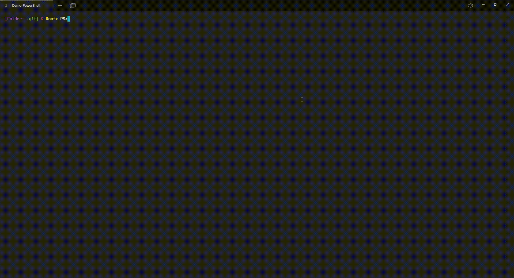

# 🚀 Configuración de PowerShell 🛠️

Este archivo de perfil, llamado Microsoft.PowerShell_profile.ps1, contiene una configuración personalizada para mejorar tu experiencia con PSReadLine y cambiar la apariencia del prompt en PowerShell.

## 📜 Funcionalidades:

- Configura la fuente de predicción para utilizar el historial en la predicción de comandos de PowerShell.
- Establece el estilo de vista de predicción a ListView para la predicción de comandos de PowerShell.
- Define una función de prompt personalizada para personalizar la apariencia del prompt de PowerShell.

## 📋 Instrucciones de Uso:

1. **Abrir PowerShell como Administrador:** Para instalar PSReadLine y editar el perfil de PowerShell, abre PowerShell como administrador.

2. **Instalar PSReadLine:** Ejecuta el siguiente comando en PowerShell para instalar PSReadLine:
   ```powershell
   [Folder: My-config-Powershell] & Root> PS>Install-Module PSReadLine -Force

3. **Abrir el Perfil de PowerShell:** Si el archivo de perfil de PowerShell no existe, PowerShell te pedirá que lo crees. Ejecuta el siguiente comando en PowerShell para abrir el perfil de PowerShell en Notepad:
   ```powershell
   [Folder: My-config-Powershell] & Root> PS>notepad $PROFILE

4. **Agregar Configuración de PSReadLine:** Agrega las siguientes líneas al perfil de PowerShell para configurar PSReadLine:
   ```txt
   Set-PSReadLineOption -PredictionSource History
   Set-PSReadLineOption -PredictionViewStyle ListView

5. **Configurar la Apariencia del Prompt:** Agrega las siguientes líneas al perfil de PowerShell para la personalización del Prompt:
   ```txt
   function prompt {
        $path = (Get-Location).Path
        $folderName = Split-Path -Path $path -Leaf
        $folderLabel = "Folder:"
        $folderNameColor = "Green"
        $separator = "&"
        $userPrincipal = New-Object Security.Principal.WindowsPrincipal([Security.Principal.WindowsIdentity]::GetCurrent())

        if ($userPrincipal.IsInRole([Security.Principal.WindowsBuiltInRole]::Administrator)) {
            $userType = "Root"
            $userTypeColor = "Yellow"
            $separatorColor = "Red"
        } else {
            $userType = "USER"
            $userTypeColor = "Green"
            $separatorColor = "Red"
        }

        Write-Host -NoNewline "[$($folderLabel) " -ForegroundColor Magenta
        Write-Host -NoNewline "$($folderName)] " -ForegroundColor Green
        Write-Host -NoNewline "$($separator)" -ForegroundColor $separatorColor
        Write-Host -NoNewline " "
        Write-Host -NoNewline "$($userType)> " -ForegroundColor $userTypeColor
    }

6. **Guardar y Cerrar:** Guarda los cambios en el perfil de PowerShell y cierra Notepad.

7. **Reiniciar la terminal de PowerShell:** Cierra y vuelve a abrir la PowerShell, esta se vera de la siguiente forma:
    ```powershell
       [Folder: My-config-Powershell] & Root> PS>
    ```
    - `[Folder: My-config-Powershell]`: Indica la carpeta en la que estamos ubicados. Si la ruta es muy larga, se muestra solo el nombre de la carpeta.
    - `&`: Es una separación entre la ruta de la carpeta y el indicador de administrador.
    - `Root>`: Indica que estás ejecutando PowerShell como administrador. Si no estás como administrador, mostrará `USER` en su lugar.
    - `PS>`: Este símbolo representa el prompt de PowerShell, indicando que el sistema está listo para recibir comandos.


8. Podemos jugar cambiando los colores a nuestro gusto ( en el archivo 'Microsoft.PowerShell_profile.ps1' se indica para que sirve cada linea) en el archivo de configuración ejecutando:
    ```powershell
       [Folder: My-config-Powershell] & Root> PS>notepad $PROFILE


<p align="center">
  
</p>